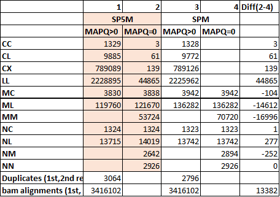
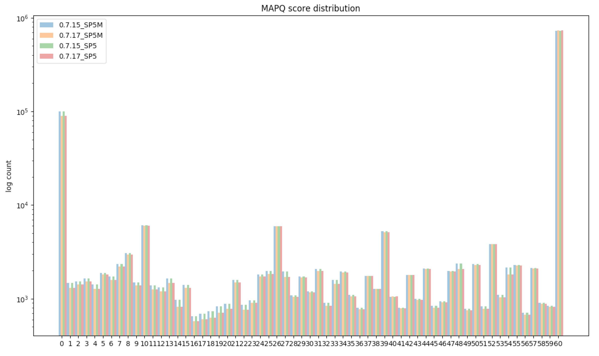

* The following is some analysis of two `bwa` versions: 'old'(=bwa-0.7.15-1142-dirty) and 'new'(=bwa_0.7.17), with `-SP5M` option, performed by Carl Vitzthum and Dhawal Jain. The purpose of the analysis was to confirm the 4DN-DCIC proposed alignment option for Hi-C data.

### Intro of the new version
* Thew 'new' version of `bwa` was released by Heng Li to correct an issue of reporting different MAPQ scores when run with -5 vs no -5. The source of the problem was that `bwa` always capped the MAPQ score of the supplementary/secondary alignment to that of representative/primary alignment. Since the option -5 changes the choice of representative/primary alignment, the MAPQ score can change. Neva Durand found and reported this issue and the new version now does *not* cap MAPQ scores when the option -5 is used.

* `bwa` release note for the 'new' version
  * "BWA outputs identical alignments to the previous version unless option -5 is used"

* Heng Li's summary of the 'new' version
  * 1) By default, the primary alignment is the one with the best alignment score (the AS tag). The mapq of supplementary alignments will be capped by the mapq of the primary.
  * 2) When -5 is applied, the primary alignment is the one with the smallest mapping coordinate. The mapq of supplementary alignments is not lowered.
  * 3) When -q is applied, the primary alignment is the one with the best AS. The mapq of supplementary alignments is not lowered.

* To summarize the difference between old and new:
  * Old version : always lower MAPQ for supp/sec
  * New version :  lower MAPQ for supp/sec only without -5
  * Primary alignments should have identical MAPQ between old and new.
  * Supp/Sec alignment should have higher MAPQ in new with -5.

  * Code commits
    * https://github.com/lh3/bwa/commit/340babdd671eeeb3c7bfbf2e4ad1e761ece94983 
    * https://github.com/lh3/bwa/commit/b58281621136a0ce2a66837ba509716c727b9387

### Analysis

* The following are some of the actual comparisons:
  * (note: by default, chimeric ailgnments are split into `representative` and `supplementary`, but with `-M`, they are annotated as `primary` and `secondary` instead.)

#### Alignment category stats, `SP5M` vs `SPM` (with vs without `-5`)
* (Dhawal Jain)
  * 'old' `bwa mem` was run in paired-end mode with either `-SP5M` or `-SPM` on a real Hi-C data. Then, various alignment categories were counted using `pairsamtools`, using a version available mid-September 2017.
    * 
    * More reads are lost to MAPQ=0 when `SP5M` was used.
    * The difference was probably because the MAPQ of a secondary alignment was lowered to that of primary alignment in both cases, but the choice of the primary alignment was different and without `-5` the priamary alignment must have a better MAPQ score, because by default `bwa` chooses the alignment with the maximum alignment score to be primary.

#### MAPQ score distribution, old vs new
* (Carl Vitzthum)
  * 'old' and 'new' versions of `bwa mem` were run in paired-end mode with `-SP5M` on a real Hi-C data. Then, compared MAPQ score distribution among primary alignments (`samtools view -F256` filtering)
    * MAPQ score distribution of primary alignments was identical between old and new versions of `bwa`.
    * This makes sense since the new version should affect only supplementary/secondary alignments, and in this case, the reads are grouped into primary vs secondary due to the `-M` option.

  * 'old' and 'new' versions of `bwa mem` were run in paired-end mode with either `-SP5M` or `-SP5` on a real Hi-C data. Then, compared MAPQ score distribution among all alignments (no filtering)
    * 
    * MAPQ scores were higher with the new version with either `-SP5M` and `-SP5` flags.
    * This also makes sense since the new version does *not* lower MAPQ for supplemenary (`-SP5`) or secondary (`-SP5M`) alignments when `-5` is used.
    * The same effect applies to both secondary and supplementary alignments.

    
