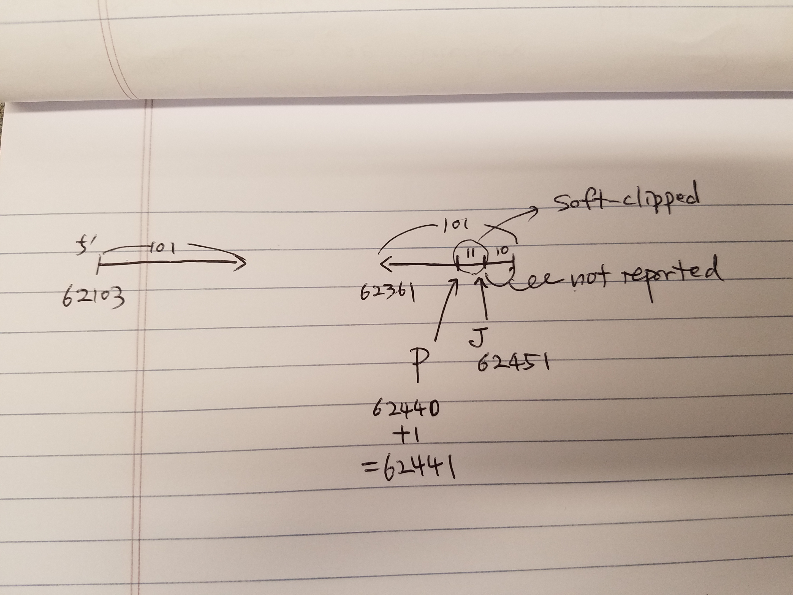

## Comparison between juicer-produced pairs and pairsamtools-produced pairs
### (w/ Scott Kallgren)

### Data
* Input bam file that was fed to pairsamtools `/n/data1/hms/dbmi/park/DATA/4DN/data_files/bam/Rao_et_al/SRR1658672.bam` (orchestra) (51G)
  * Scott's final output: `~spk8/work/data/4dn/pipeline/pairsam/Rao_et_al/SRR1658672_4_16G_sorted_16G.nodups.pairs.gz` (orchestra) (3.4G)
* The corresponding fastq was fed to jucier to create pairs. https://s3.amazonaws.com/elasticbeanstalk-fourfront-webdev-wfoutput/755230c2-7ce1-4f31-b101-eb2668083492/4DNFI9U1FBR2.pairs.gz (3.92 GB pairs file)
* The file size difference between the two pairs may be due to the number of columns

### Method
* `gunzip` and then taking `diff` between two pairs files.
* After `gunzip`, Scott had to remove the additional columns (two flag columns from juicer output, one column from pairsamtools output)
* After that..
```
==> 1_4DN.pairs <==
GLPB22-B5C:524:H0LKVADXX:2:2201:19020:66431/1    chrY    56880801    chrY    56881152    +    -
GLPB22-B5C:524:H0LKVADXX:1:2115:20748:54184/2    chrY    56880802    chrY    56881159    +    -
GLPB22-B5C:524:H0LKVADXX:2:1212:13836:42982/1    chrY    56881592    chrY    56882008    +    -
GLPB22-B5C:524:H0LKVADXX:2:2209:11730:65847/1    chrY    56881651    chrY    56883804    +    -
GLPB22-B5C:524:H0LKVADXX:1:2114:18937:6982/1    chrY    56883681    chrY    56884113    +    -
GLPB22-B5C:515:H0993ADXX:1:2105:12526:97528/1    chrY    56883783    chrY    56884118    +    -
GLPB22-B5C:515:H0993ADXX:2:2103:13647:35610/1    chrY    56883806    chrY    56885897    -    +
GLPB22-B5C:524:H0LKVADXX:1:2203:12828:30450/1    chrY    56885124    chrY    56885501    +    -
GLPB22-B5C:524:H0LKVADXX:2:2205:12739:63695/1    chrY    56886282    chrY    56886609    +    -
GLPB22-B5C:515:H0993ADXX:2:2214:7955:30678/2    chrY    56886323    chrY    56886668    +    -

==> 2_672.pairs <==
GLPB22-B5C:515:H0993ADXX:2:1104:19234:51096    chrY    56880812    chrY    56881224    +    -
GLPB22-B5C:524:H0LKVADXX:2:2211:18948:3029    chrY    56880812    chrY    56881230    +    -
GLPB22-B5C:524:H0LKVADXX:2:1212:13836:42982    chrY    56881592    chrY    56881988    +    -
GLPB22-B5C:524:H0LKVADXX:2:2209:11730:65847    chrY    56881651    chrY    56883805    +    -
GLPB22-B5C:524:H0LKVADXX:1:2114:18937:6982    chrY    56883702    chrY    56884098    +    -
GLPB22-B5C:515:H0993ADXX:1:2105:12526:97528    chrY    56883783    chrY    56884104    +    -
GLPB22-B5C:515:H0993ADXX:2:2103:13647:35610    chrY    56883807    chrY    56885897    -    +
GLPB22-B5C:524:H0LKVADXX:1:2203:12828:30450    chrY    56885124    chrY    56885502    +    -
GLPB22-B5C:524:H0LKVADXX:2:2205:12739:63695    chrY    56886300    chrY    56886610    +    -
GLPB22-B5C:515:H0993ADXX:2:2214:7955:30678    chrY    56886323    chrY    56886651    +    -
```

  * We should remove `/1` and `/2` from juicer pairs
  * We should add 1 to the positions to juicer pairs when the strand is -.
* So, before `diff` the following code has to be applied to juicer-produced pairs to make it comparable to pairsamtools pairs.

```
zcat <file> | sed "s/\/[12]//g" | awk '{if ($6=="-") $3=$3+1; if ($7=="-") $5=$5+1; print $1"\t"$2"\t"$3"\t"$4"\t"$5"\t"$6"\t"$7}' 
```


### 0. Reading BAM file
* Both Sequence and CIGAR are consistent with genome not the read.
* For reverse complementary alignments, (+16 in flag), the sequence is flipped from the original seuqence in fastq.

### 1. Case study
```
30,33c27,30
< GLPB22-B5C:524:H0LKVADXX:2:1206:11051:45535      chr1    62103   chr1    62452   +       -
< GLPB22-B5C:524:H0LKVADXX:2:1113:11548:21474      chr1    62108   chr1    62463   +       -
< GLPB22-B5C:524:H0LKVADXX:2:2111:20032:37699      chr1    62133   chr1    62458   +       -
< GLPB22-B5C:515:H0993ADXX:1:1106:2040:12843       chr1    62165   chr1    62468   +       -
---
> GLPB22-B5C:524:H0LKVADXX:2:1206:11051:45535      chr1    62103   chr1    62441   +       -
> GLPB22-B5C:524:H0LKVADXX:2:1113:11548:21474      chr1    62108   chr1    62441   +       -
> GLPB22-B5C:524:H0LKVADXX:2:2111:20032:37699      chr1    62133   chr1    62441   +       -
> GLPB22-B5C:515:H0993ADXX:1:1106:2040:12843       chr1    62165   chr1    62441   +       -


# mate1, rc
GLPB22-B5C:524:H0LKVADXX:2:1206:11051:45535     81      chr1    62361   9       80M11S  =       62103   -338    TATACTATGAAGATATCAACCTTTTGTCTCTACAGCATTTCAAATTCAAGTATGATTCACGTGTTGGTTTGGGGTAGATCGATCAGAGAAA     FFBBFFFFFFFFFFFFFFFFFFFFFFIIIIFIIIIFIIIIIIIIIIIIIIIIIIIIIIFIIIIIIIIIIIIIIIIIIIIIIIIFFFFFFFF     NM:i:0  MD:Z:80 AS:i:80 XS:i:75 XA:Z:chr19,-103947,80M11S,1;chr15,+101928216,11S80M,1;  Yt:Z:LL

# mate2
GLPB22-B5C:524:H0LKVADXX:2:1206:11051:45535     161     chr1    62103   26      96M5S   =       62361   338     CACCCTCCTCGGCCTCCCAAAGTGCTGGGATAACAGGCGTGAACAACCATGCCCGGCCTGTAAAACTTTTTCCTAATTTAACAGAAAAATAATAGTGCCAA   BBBFFFFFFFFFFIIIIIIIIIFFFIIIIIIIIIIIIIIFIIIIIIIIIIIIIIIFFFFFBBFFFFFFFFFFFFBFFFFFFFFFFFFFFFFFFFF0BBBFF   NM:i:0  MD:Z:96 AS:i:96 XS:i:86 XA:Z:chr15,-101928462,5S96M,2;chr19,+103681,96M5S,3;    Yt:Z:LL


5'end to 5'end should be chr1 62103 to chr1 62451 (mate1 is somehow 91bp instead of 101bp).
Pairsamtools is reporting the chimeric junction (11bp inward from 5'end of mate1)
Juicer is reporting the chimeric junction + soft-clipped length.
Pairsamtools makes more sense in this particular case.

1: pe
8: next segment unmapped
16: rc
32: next segment rc
64: mate1
128: mate2

81 = 64+16+1 (mate1, rc)
161 = 128+32+1 (mate2)
```



* These cases should be thrown away because it doesn't contain information about contacting loci.


