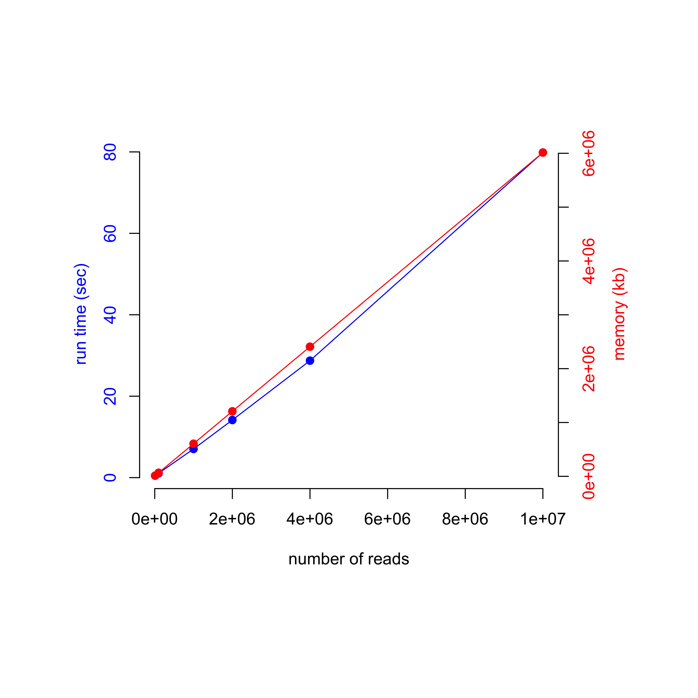

### Benchmarking result for pgltools

#### Method
* I subsampled from a 1 billion read K562 in-situ Hi-C pgl file and queried the entries that occurs at the very beginning of the file (1:1-20000000|1:1-20000000) - supposedly among the easiest queries.
* Note: The file is position-sorted, so the second region query may slow down the query speed a bit.

* Example query command
```
pgltools window -a K562_insitu_merged_nodups_all_read.psorted.ss10M.pgl -window1 1:1-20000000 -window2 1:1-20000000
```

#### Conclusion.
* Memory and run time was linear to the number of reads in the file. 



* I'm guessing that most of this seems to be spent on building an internal index.
* Estimated memory and run time for 1 billion reads is ~600GB mem and ~2 hours of run time.
* It is practically difficult to use for large-scale Hi-C files.
